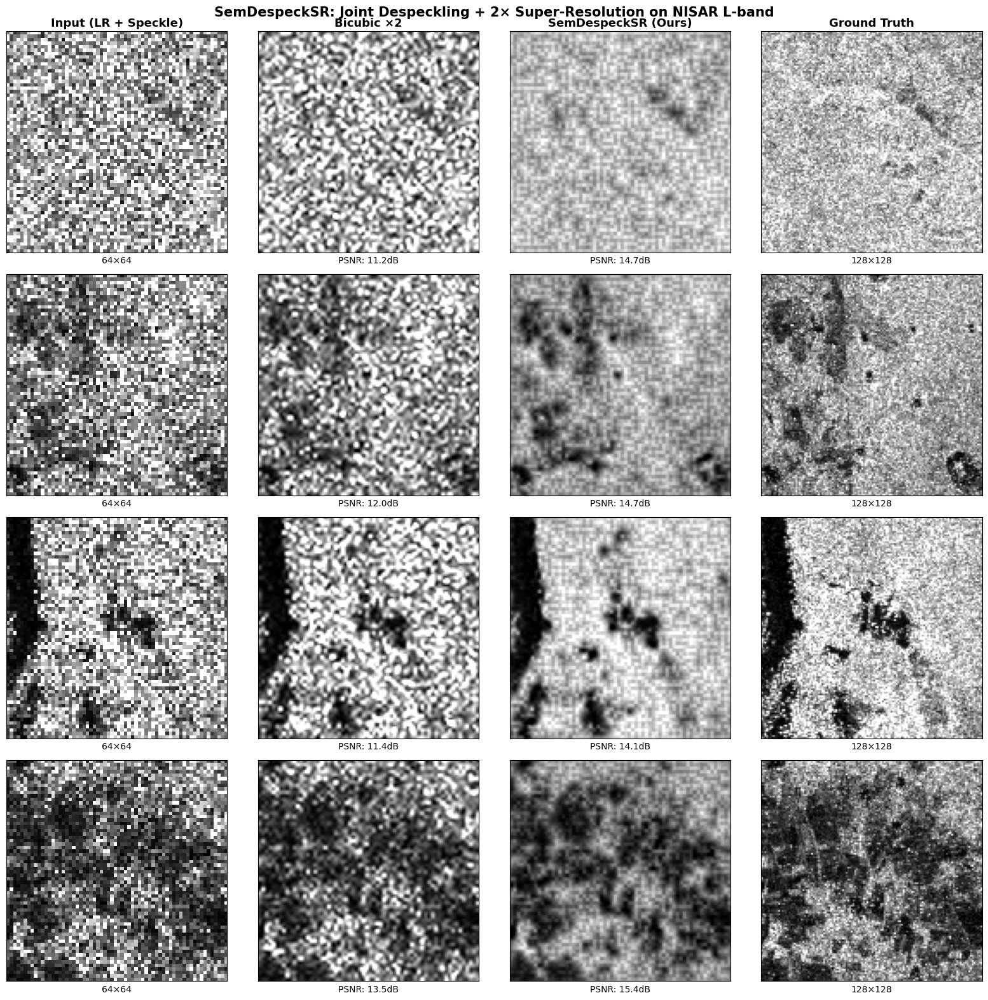
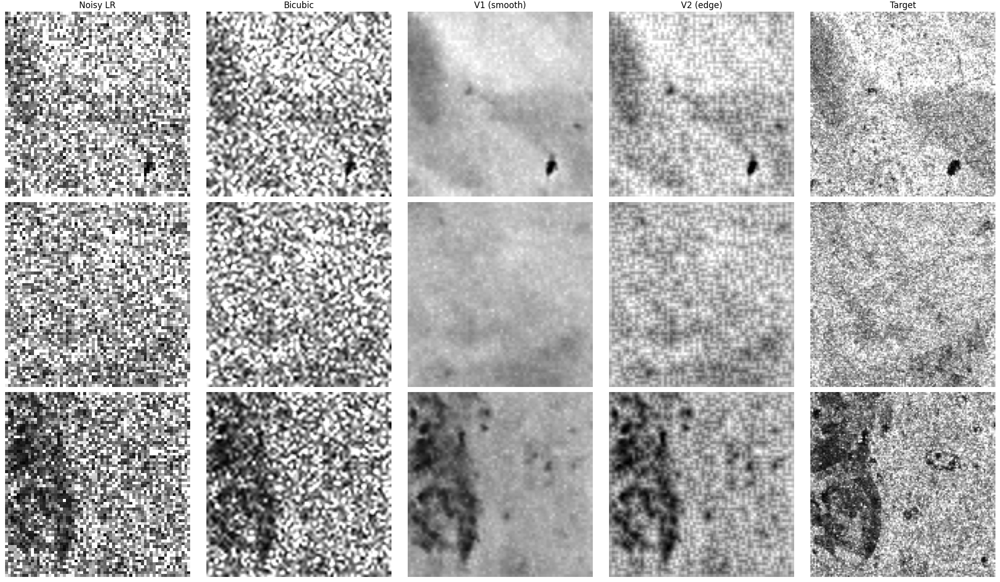
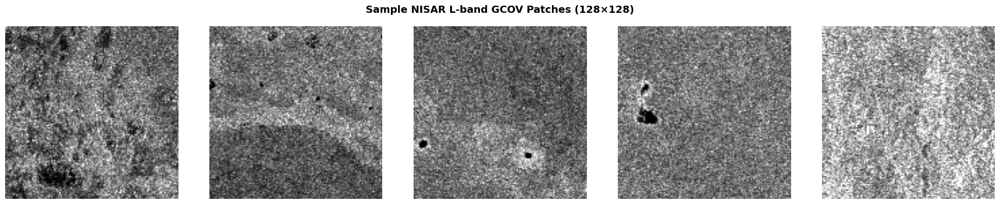
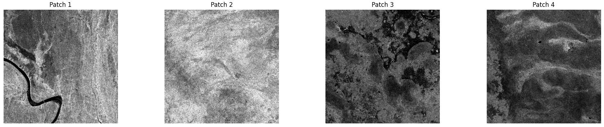
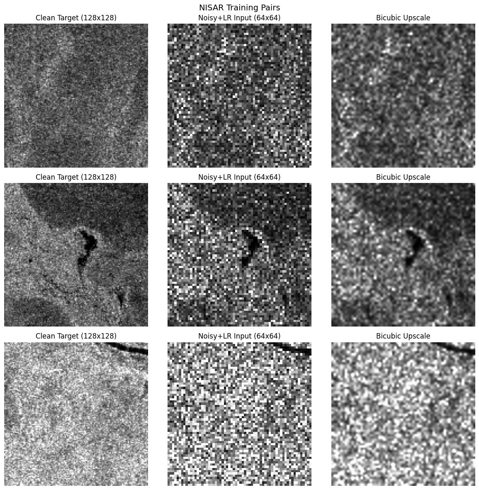

# SemDespeckSR

### Semantic-Conditioned Joint SAR Despeckling and Super-Resolution

[](https://nisar.jpl.nasa.gov/)
[](https://huggingface.co/datasets/YiminJimmy/SARLANG-1M)
[](https://pytorch.org/)
[](LICENSE)

> A joint despeckling and 2× super-resolution framework for SAR imagery, combining wavelet-domain frequency separation, ESRGAN-based reconstruction, and semantic scene conditioning via CLIP embeddings derived from [SARLANG-1M](https://huggingface.co/datasets/YiminJimmy/SARLANG-1M). Trained and evaluated on real [NISAR](https://nisar.jpl.nasa.gov/) L-band satellite data.

---

## Why This Exists

SAR (Synthetic Aperture Radar) images suffer from **speckle noise** — an inherent artifact of coherent radar imaging — and are often acquired at limited spatial resolution. Most existing approaches treat despeckling and super-resolution as separate problems. This project tackles both simultaneously while introducing **semantic scene awareness**: the network adapts its restoration strategy based on what it understands about the scene content (water, terrain, urban structures, etc.).

Three things make this different from existing SAR restoration work:

1. **Semantic conditioning from SARLANG-1M** — Scene embeddings from 31,968 expert-annotated SAR captions guide the network via AdaIN. No prior SAR despeckling work has used language-derived scene understanding.
2. **Wavelet-domain input to ESRGAN** — A 2D DWT decomposes the input into frequency subbands before the network sees it, giving explicit speckle-structure separation. This combination is not in existing literature.
3. **Real NISAR data** — Trained on 19,286 patches from NASA-ISRO's NISAR satellite (launched 2025), not synthetic benchmarks.

---

## Results

Evaluated on 500 held-out patches from NISAR L-band GCOV data:

| Metric | Bicubic Baseline | SemDespeckSR | Improvement |
|--------|:---:|:---:|:---:|
| **PSNR** ↑ | 11.83 dB | **14.80 dB** | +3.0 dB |
| **SSIM** ↑ | 0.318 | **0.359** | +13% |
| **ENL** ↑ | 5.77 | **24.88** | 4.3× better speckle suppression |
| **EPD** →1 | 1.56 | **0.81** | Much closer to ideal |

> **ENL** (Equivalent Number of Looks) measures speckle suppression — higher means cleaner. **EPD** (Edge Preservation Degree) measures structural retention — 1.0 is perfect.

### Visual Comparison


*From left to right: noisy low-resolution input (64×64), bicubic upscale, SemDespeckSR output, ground truth (128×128). Our model simultaneously removes speckle and reconstructs spatial detail.*

### Ablation: Effect of Edge-Preserving Loss


*V1 (L1 loss only) over-smooths the image. V2 (L1 + SSIM + Edge loss) preserves texture and fine structure while still suppressing speckle.*

---

## Architecture

```
                              ┌──────────────────────┐
                              │  CLIP Scene Embedding │
                              │  (from SARLANG-1M)    │
                              └──────────┬───────────┘
                                         │ AdaIN injection
                                         ▼
Input ──► 2D DWT ──► [LL|LH|HL|HH] ──► Conv ──► Conditioned RRDB ×16 ──► PixelShuffle ──► Output
(1,64,64)  (Haar)    (4,32,32)                   (scene-adaptive)         (upsample ×4)    (1,128,128)
```

**Key components:**
- **Wavelet preprocessing** — Haar DWT splits input into 4 frequency subbands. The LL band carries scene structure; LH/HL/HH bands isolate speckle-dominated high frequencies.
- **Conditioned RRDB blocks** — 16 Residual-in-Residual Dense Blocks, each modulated by scene embeddings via Adaptive Instance Normalization (AdaIN). This allows the network to despeckle differently per scene type.
- **Pixel Shuffle upsampling** — Sub-pixel convolution for artifact-free 2× super-resolution (4× total to compensate for DWT spatial halving).
- **SAR-specific losses** — L1 + SSIM + Sobel edge loss. No VGG perceptual loss (it's trained on ImageNet photos and is meaningless for SAR backscatter).

---

## Dataset

### NISAR L-band (Training & Evaluation)

Real SAR data from the [NASA-ISRO SAR Mission](https://nisar.jpl.nasa.gov/), accessed via [ASF DAAC](https://asf.alaska.edu/).

- **Product:** L2 GCOV (Geocoded Covariance), HH polarization
- **Patches:** 19,286 patches of 128×128 pixels, extracted with 50% overlap
- **Training pairs:** Multi-looked GCOV as "clean" target, synthetic Gamma speckle (L=1 look) added to create noisy inputs following standard SAR despeckling protocol


*Sample NISAR L-band patches showing diverse terrain: rivers, arid land, water bodies, mixed vegetation.*


*Full NISAR L-band GCOV scene (512×512 crops) — rivers, coastal features, terrain with visible speckle texture.*

### SARLANG-1M (Scene Conditioning)

Scene semantics from the [SARLANG-1M benchmark](https://huggingface.co/datasets/YiminJimmy/SARLANG-1M) (Wei et al., IEEE TGRS 2026).

- 31,968 expert-reviewed SAR scene captions analyzed to define 10 scene prototypes
- CLIP ViT-B/32 encodes both text descriptions and SAR patches into a shared 512-dim embedding space
- Scene categories: `urban_dense`, `urban_industrial`, `residential`, `water_body`, `port_harbor`, `vegetation`, `agricultural`, `desert_barren`, `coastal`, `mixed_terrain`


*Training data pipeline: clean target (left), noisy + downscaled input (center), bicubic upscale showing speckle (right).*

---

## Project Structure

```
SemDespeckSR/
├── models/
│   ├── wavelet.py              # Differentiable 2D DWT/IDWT layers
│   ├── rrdb.py                 # Residual-in-Residual Dense Blocks
│   ├── generator.py            # Scene-conditioned generator (AdaIN + DWT + RRDB)
│   └── discriminator.py        # PatchGAN discriminator
├── losses/
│   └── sar_loss.py             # L1 + SSIM + Edge + ENL losses
├── metrics/
│   └── evaluate.py             # PSNR, SSIM, ENL, EPD computation
├── data/
│   ├── dataset.py              # PyTorch Dataset with speckle injection
│   ├── preprocess.py           # NISAR HDF5 → amplitude patches
│   └── scene_encoder.py        # CLIP-based scene embedding pipeline
├── configs/
│   └── default.yaml            # Training hyperparameters
├── inference.py                # Single-image inference script
├── assets/                     # Result figures
└── README.md
```

---

## Installation

```bash
git clone https://github.com/AkshitSingh7/SemDespeckSR-Semantic-Conditioned-SAR-Despeckling-and-Super-Resolution.git
cd SemDespeckSR-Semantic-Conditioned-SAR-Despeckling-and-Super-Resolution

pip install torch torchvision
pip install pytorch_wavelets    # or: pip install git+https://github.com/fbcotter/pytorch_wavelets.git
pip install open_clip_torch
pip install h5py numpy PyYAML
```

**Requirements:** Python 3.10+, PyTorch 2.0+, CUDA-capable GPU (trained on A100 80GB, runs inference on any GPU)

---

## Usage

### Inference

```python
from models.generator import SARWaveSRNet
import torch

# Load model
model = SARWaveSRNet(scale=2, embed_dim=512).cuda()
model.load_state_dict(torch.load('checkpoints/best_model.pth'))
model.eval()

# Input: (1, 1, 64, 64) SAR amplitude patch
# Embed: (1, 512) CLIP scene embedding
with torch.no_grad():
    output = model(input_patch, scene_embed)  # → (1, 1, 128, 128)
```

### Generating Scene Embeddings

```python
from data.scene_encoder import encode_patches_with_clip, build_scene_prototypes
import open_clip

model, _, _ = open_clip.create_model_and_transforms('ViT-B-32', pretrained='laion2b_s34b_b79k')
model = model.cuda().eval()

# Encode your SAR patches
embeddings = encode_patches_with_clip(your_patches, model)
```

### Data Preparation

```python
from data.preprocess import extract_patches_from_nisar

# Extract patches from NISAR GCOV HDF5
patches = extract_patches_from_nisar(
    'path/to/NISAR_GCOV.h5',
    patch_size=128,
    stride=64
)
```

---

## Training

Training proceeds in two phases:

**Phase 1 — Generator pretraining (150 epochs)**
L1 + SSIM + Edge loss, cosine LR schedule, no adversarial component. This establishes stable reconstruction quality.

**Phase 2 — GAN fine-tuning (optional)**
Add PatchGAN discriminator with very conservative adversarial weight (0.0005). In our experiments, GAN fine-tuning did not improve over Phase 1 — the discriminator collapsed. This remains an area for future work.

See `configs/default.yaml` for all hyperparameters.

---

## Limitations & Future Work

- **Single NISAR scene** — Currently trained on patches from one GCOV product. More geographic diversity would improve generalization.
- **GAN instability** — The adversarial component consistently collapsed during training. Alternative discriminator architectures (e.g., spectral normalization, multi-scale) may help.
- **No true ground truth** — Like all SAR despeckling work, our "clean" targets still contain residual speckle. The model can only learn to match multi-looked quality, not achieve perfect reconstruction.
- **Scene conditioning impact** — Improvement over unconditioned baseline is modest (~0.3 dB PSNR). Richer scene descriptions or finer-grained conditioning may amplify the benefit.
- **Full VLM integration** — Currently using CLIP embeddings as a proxy. Direct integration of SARLANG-1M's fine-tuned VLM for richer scene descriptions is a natural next step.

---

## Citation

```bibtex
@misc{semdespecksr2026,
  author = {Singh, Akshit},
  title  = {SemDespeckSR: Semantic-Conditioned Joint SAR Despeckling
            and Super-Resolution via Wavelet-ESRGAN},
  year   = {2026},
  url    = {https://github.com/AkshitSingh7/SemDespeckSR-Semantic-Conditioned-SAR-Despeckling-and-Super-Resolution}
}
```

## Acknowledgments

- **[NISAR Mission](https://nisar.jpl.nasa.gov/)** — NASA/ISRO for open L-band SAR data
- **[SARLANG-1M](https://arxiv.org/abs/2504.03254)** — Wei et al. (IEEE TGRS 2026) for the SAR vision-language benchmark that enabled semantic conditioning
- **[ESRGAN](https://github.com/xinntao/ESRGAN)** — Wang et al. for the RRDB architecture
- **[OpenCLIP](https://github.com/mlfoundations/open_clip)** — Open-source CLIP implementation

## License

MIT
